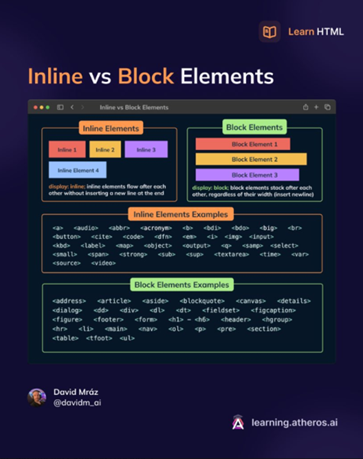

# ApuntesASIX1

## Primer capítulo: GITHUB Y PAGES
AL crear un repositorio en Github siempre hay que inicializarlo añadiendo el "READE.md".

"IMPORTANTE": Debemos estar en un cmd para ejecutar los comandos y tener en cuenta la ruta de donde estamos, preferiblemente en la ruta donde se va a meter el reposiorio o donde ya esta.

__Para clonar el repositorio de github y poder trabajarlo en local:__
```
"git clone" (ruta del repositorio a clonar).
```
Para añadir todo lo que hemos modificado habra que ejecutar estos 3 comandos:
```
git add.(Añadir las cosas nuevas)
git commit -m "(Nombre del commit)"
git push origin main (Subir del origen a la rama main de github)
```
Una vez ejecutados si fueramos al github veriamos que todo lo que hemos hecho en local se habría subido.

__Otros comandos de git:__
EL git init git branch (Para ver en que rama está el repositorio) git branch -M main (Le dice que la rama donde va a poner el rerpositorio es.main).

El git pull para traer de gtihub a mi ordenador.
<br>

#### PAGES
Para hacer que un repositorio de github se transforme en pagina web iremos a configuración (settings), en el menú de la izquierda seleccionaremos pages.
Seleccionamos la rama(Branch) Main y le damos a guardar (save). Al hacer esto y esperar un poco se nos creará un enlace a nuestra página.
<br>
<br>

## Segundo capítulo: Markdown 

(#) Esto sirve para poner encabezados, hay 6 niveles como en HTML, al poner este encabezado te pone un enlace en el título.
```
## Segundo nivel de encabezados
### Tercero nivel de encabezados
#### Cuarto nivel de encabezados
##### Quinto nivel de encabezados
###### Sexto nivel de encabezados
```

Este texto esta en *cursiva*- * *

Este texto esta en _cursiva_. _ _

Este texto esta en __negrita__. __ __

Este texto esta en **negrita**. ** **

Este texto esta en **_negrita y cursiva_**. ** _ _ ** 

Este texto esta en __*negrita y cursiva*__. __ * * __

1. Primera opción de menu. Esto es una lista ordenada.
2. Segunda opción de menu.
3. Tercera opción de menu.

(La lista desordenada se hace con el - , con * y con el +)
* Primera opción de lista desordenada
* Segunda opción de lista desordenada
- Tercera opción de lista desordenada
    1. Primera submenú 
    2. Segundo submenú
- Cuarta opción de lista desordenada
    * Tercer submenú
    * Cuarto submenú
+ Quinta opción de lista desordenada
+ Sexta opción de lista desordenada
<br>
Hay que dejar un espacio en blanco para que siga en otra linea 
<br>

**Como mostrar código en un repositorio**

```
<!DOCTYPE html>
<html lang="en">
<head>
    <meta charset="UTF-8">
    <meta name="viewport" content="width=device-width, initial-scale=1.0">
    <title>Document</title>
</head>
<body>
    
</body>
</html>
```
<br>

### Como poner un link
[Pagina web de Jesuites Bellvitge](https://www.fje.edu/ca/fje "Titulo opcional")

### Como poner una imagen


Una tabla:

|Titulo 1| Titulo 2| Titulo 3 |
|---------------|:------------:|---------:|
|SMX2 |Curso 2324|25|
|**ASIX1**|Curso 2425|33|
|DAW2|Curso 2425|32|
<br>

## Tercer capítulo: HTML 

```
Etiquetas de apertura y cierre.
apertura --> <p>(contenido visible)</p> <-- cierre

Todo el parrafo incluyendo las etiquetas se llama elemento
<p class "valor"> texto a mosrar </p>

Anidar etiquetas: Meter una etiqueta dentro de otra
<p> balala <strong> negrita </strong> adadada <p>

El texto que esta en strong estara en negrita y lo demas no, todo en conjunto sera un parrrafo.

Las etiquetas no tienen porque tener que ir solas, en la etiqueta de apertura se ponen los atributos, siempre van separados con un espacio.
Algunas etiquetas como img necesitan si o si atributos.


Para añadir una imagen

<br> --> para dejar un espacio en blanco entre lineas.
```

HTML tiene una estructura. Siempre empieza con el doctype html para indicarle al navegador web que tipo de lenguaje es y así lo pueda renderizar.

html:5 para añadir al archivo las partes de un documento html.

```
<!DOCTYPE html> (Le decimos al docuemnto que tipo de documento es)

<html lang="en"> Inicio, se vaa poner el codigo a partir de aqui.

</html> Es el cierre de la etiqueta anterior. Despues de esta etiuqeta no se pone codigo.

encabezado --> <head> </head> (Va al principio de la pagina es la parte donde definimos las caracetristicas de la pagina y donde metemos todo el contenido no visible por los visitantes. Enlaces)


<meta charset="UTF-8"> que set de caracteres tiene que cojer la pagina, en este caso coje el que utilizamos, con la ñ añadida por ejemplo.

<meta name="viewport" content="width=device-width, initial-scale=1.0"> Como se ve a ver el ancho de la pantalla.

<title>Document</title> Es el titulo de la pagina. en la pestaña del navegador se vera lo quese ponga

<link rel="stylesheet" href="style.css">: vincular la página con la pagina de estilos.

<favicon> para definir el icono de la pagina web que  s eve arriba en la pestaña del navegador.

cuerpo --> <body> </body>
```

Elemento body:
Aquí va lo que se verá en la página web, aquí va todo el contenido y se hace mediante etiquetas.

Hay dos categorias de etiquetas:

Etiquetas de bloque: Cuando se acaba de renderizar el contenido de etiqueta deja un espacio de linea. Ej: las etiquetas de titulo, parrafo, listas, tablas.

Etiquetas de linea: Cuando se acaba de renderizar la etiqueta __NO__ hace un salto de linea. Ej: span , strong...

Algunos elementos de linea y bloque:



A la hora de hacer código HTML queremos que haya un orden para que sea legible así que habrá que tabular el código.

No todas la setiquetas se cierran o se abren.
<br>
<br>

#### Organización de los archivos
En la raíz siempre pondremos el index.html, luego podremos tener carpetas para las diferentes secciones de la página web, una para las imágenes, una para el segundo plato y otra para el postre por ejemplo(caso de mi menú saludable).
<br>
<br>

#### Etiquetas básicas de HTML
```
h1 --> encabezado, tiene 6 niveles, cambian segun el numero, el 1 es el mas grande.

ol --> Lista ordenada
    li --> va dentro de la lista ordenada para definir cada elemento.
Ej:
<ol>
    <li>Primer elemento</li>
    <li>Segundo elemento</li>
    <li>Tercer elemento</li>
</ol>

ul --> Lista desordenada, lo mismo que la orenadda pero que con u.
Ej:
<ul>
    <li>Primer elemento</li>
    <li>Segundo elemento</li>
    <li>Tercer elemento</li>
</ul>

Tambien se pueden meter listas dentro de otras
Ej:
<ol>
    <li>Primer elemento de nvl 1</li>
    <ul>
        <li>Primer elemento de nivel 2</li>
        <li>Segundo elemento de nivel 2</li>
        <li>Tercer elemento de nivel 2</li>
    </ul>
    <li>Segundo elemento de nvl 1</li>
    <li>Tercer elemento de nvl 1</li>
</ol>

<a href=""></a> --> para hacer links, en href se pone el link de la ruta donde se quiere llegar.
Ej:
<a href="http://google.com" alt ="Texto alternativo" target="_blank">Este es el enlace a google</a>

alt: es el texto alternativo que sale cuand pasas por encima.

target blank: abre una pestaña nueva con el enlace

blockquote --> para poner una cita, te lo escribe a la derecha un poco, el texto.

<!-- Ajajajajajajajaj esto es un coemntario--> --> esto es para poner comentarios jajajajajaja.
Siempre comentar los codigos que escribamos.

 --> para poner -> las imagenes, en src se pone el encale o la ruta y el alt es el texto alternativo. Los nombres de laas imaganes que  no tengan espacios.

<strong> para poner en negrita u texto y <u> para subrayarlo.
```

EN HTML existen muchas algunos elementos que hacen de conetenedores:
Tenemos el div, section, article.
Luegopodemos diivdir la pagina en header(encabezado), footer(pie de pagina)...

#### Rutas relativas y rutas absolutas

Ruta absoluta: especifica la ubicación completa comenzando desde la raiz.

Ruta relativa: especifica la ubicación desde el punto en que nos encontramos. Utilizar siempre estas para que si le paso el código a alguien le vayan los enlaces de las imágenes y todo funcione correctamente.
<br>
<br>

#### Más etiquetas de HTML
id: Los utilizaremos para hacer enlaces en la misma página. Aquí debajo se puede observar un ejemplo. En el ejemplo si seleccionáramos el primer enlace (a) nos llevaría a la seccion1 que está situada debajo. Lo mismo pasaría si seleccionáramos el ultimo enlace, nos llevaría al principio de la página ya que es donde se encuentra el índice al que llama el enlace.

```
<h1 id="indice">INDICE</h1>
<a href="#seccion1">Enlace a la primera sección</a>

<h4 id="seccion1">Primera sección</h4>
    <p>Lorem ipsum dolor sit amet consectetur adipisicing elit. At, nesciunt voluptatum dolores aspernatur porro tempora, eveniet aut tenetur beatae a magnam quasi quis nihil ut perferendis? Consectetur aliquam cupiditate est?</p>
    <p>Lorem ipsum dolor sit amet consectetur adipisicing elit. At, nesciunt voluptatum dolores aspernatur porro tempora, eveniet aut tenetur beatae a magnam quasi quis nihil ut perferendis? Consectetur aliquam cupiditate est?</p>
    <p>Lorem ipsum dolor sit amet consectetur adipisicing elit. At, nesciunt voluptatum dolores aspernatur porro tempora, eveniet aut tenetur beatae a magnam quasi quis nihil ut perferendis? Consectetur aliquam cupiditate est?</p>
    <p>Lorem ipsum dolor sit amet consectetur adipisicing elit. At, nesciunt voluptatum dolores aspernatur porro tempora, eveniet aut tenetur beatae a magnam quasi quis nihil ut perferendis? Consectetur aliquam cupiditate est?</p>

<a href="#indice">Volver al indice</a>
```
<br>
<br>

#### Formularios
```
<form action="recepcion.php" method="post"> --> Etiqueta para abrir el formulario, el action es apra poner la URL dopdne iran los datos del formulario.
        <label for="nombre">Nombre</label>
        <input type="text" id="nombre" name="nombre" placeholder="Introduze tu nombre"><br><br>

        <label for="password">Password</label>
        <input type="password" id="password" name="password" placeholder="Introduce tu contraseña"><br><br>

        <fieldset>
            <legend>Idioma</legend>
            <label for="castellano">Castellano</label>
            <input type="radio" id="castellano" name="idioma" value="Castellano">

            <label for="castellano">Catalan</label>
            <input type="radio" id="catalan" name="idioma" value="Catalan">

            <label for="castellano">Chino</label>
            <input type="radio" id="chino" name="idioma" value="Chino">
        </fieldset>

        <fieldset>
            <legend>Nacionalidad</legend>
            <label for="espanola">Española</label>
            <input type="checkbox" id="espanola" name="nacionalidad" value="espanola">

            <label for="francesa">Francesa</label>
            <input type="checkbox" id="francesa" name="nacionalidad" value="francesa">

            <label for="canadiense">Canadiense</label>
            <input type="checkbox" id="canadiense" name="nacionalidad" value="canadiense">
        </fieldset>

        <label for="observaciones">Observaciones</label><br>
            
        <textarea name="observaciones" id="observaciones" placeholder="Introduce tus comentarios" cols="80" rows="4">
        </textarea>
        <br>
        
        <label for="ciudad">Ciudad</label><br>
        <select name="ciudad" id="ciudad">
            <option value="" disabled>Seleccione una ciudad</option>
            <option value="Barcelona">Barcelona</option>
            <option value="Madrid">Madrid</option>
            <option value="Valencia">Valencia</option>
            <option value="Sevilla">Sevilla</option>
            <option value="Granada">Granada</option>
            <option value="Murcia">Murcia</option>
        </select>
        <br>
        <br>
        <button type="submit">Enviar datos</button> 
    </form>
```

